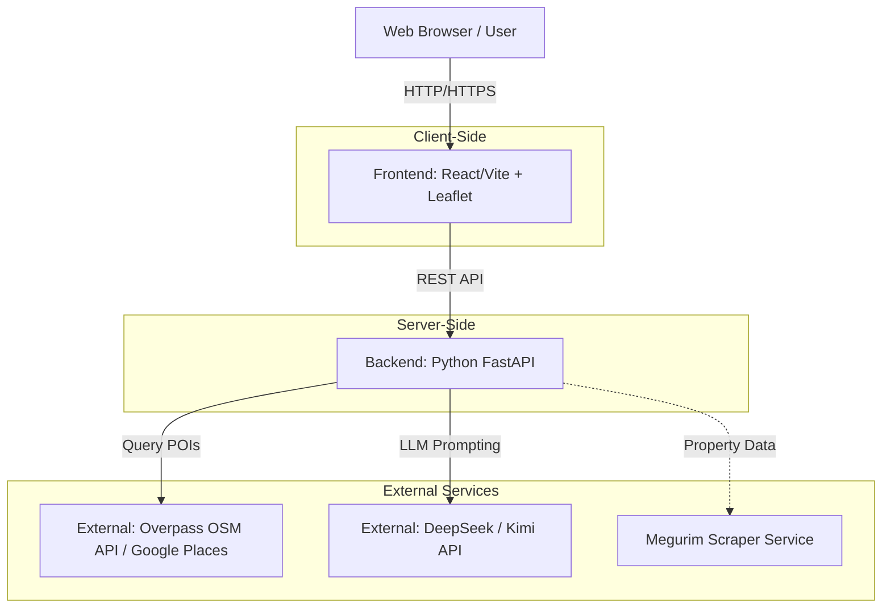

# Architecture Diagram

This document outlines the high-level architecture of the mapah.id application.

## System Architecture

## Component Description

1. **Frontend (React/Vite)**: 
   - Handles the user interface, including the interactive map for pin-dropping.
   - Responsible for presenting the Viability Score, SWOT analysis, and rendering competitor pins on the map.
2. **Backend (Python FastAPI)**: 
   - Acts as the orchestrator. It receives the coordinates and business type from the frontend.
   - Makes asynchronous HTTP requests to External Map APIs to gather raw data (competitors, foot traffic generators).
   - Formats the raw geospatial data and sends a prompt to the LLM.
   - Parses the LLM's response and returns a structured JSON back to the frontend.
3. **External Services**:
   - **Map/POI API**: Provides the raw data of places within a specific radius.
   - **LLM API**: Analyzes the context and provides human-readable business insights.
