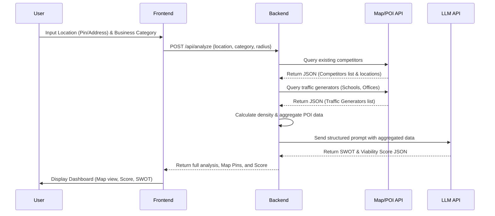

# Application Workflow

This document outlines the user workflow and system interactions for the business viability analysis process.

## Core Workflow Sequence

## Step-by-Step Breakdown

1. **Location Input**: The user selects a location on the map and specifies the business they want to open (e.g., "Coffee Shop").
2. **Analysis Request**: The frontend sends the coordinates `[lat, lng]` and category to the FastAPI backend.
3. **Geospatial Data Fetching**: The backend queries a Map API (like OpenStreetMap Overpass) to find all existing "Coffee Shops" within a 2km radius. It also queries for positive traffic anchors (schools, offices, train stations).
4. **Data Aggregation**: The backend summarizes this data: *How many competitors? How close are they to each other? How many traffic anchors exist nearby?*
5. **AI Evaluation**: This summarized context is fed into an LLM with instructions to evaluate the business viability.
6. **Result Presentation**: The parsed AI response is returned to the frontend, which renders the SWOT analysis and displays visual markers for competitors and anchors on the interactive map.
